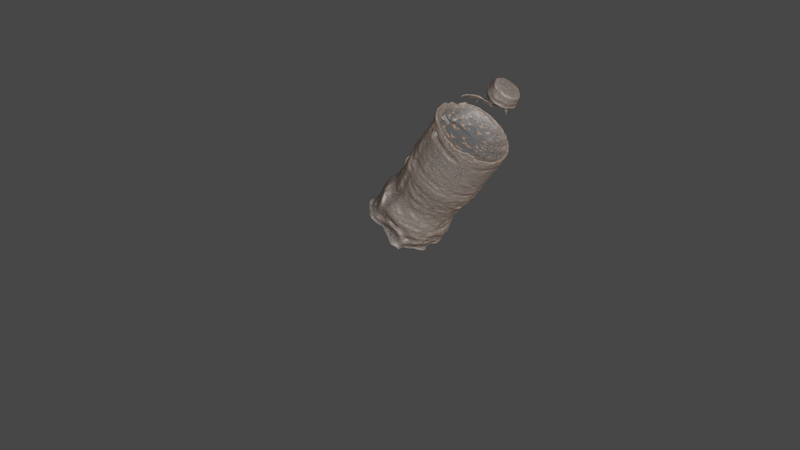
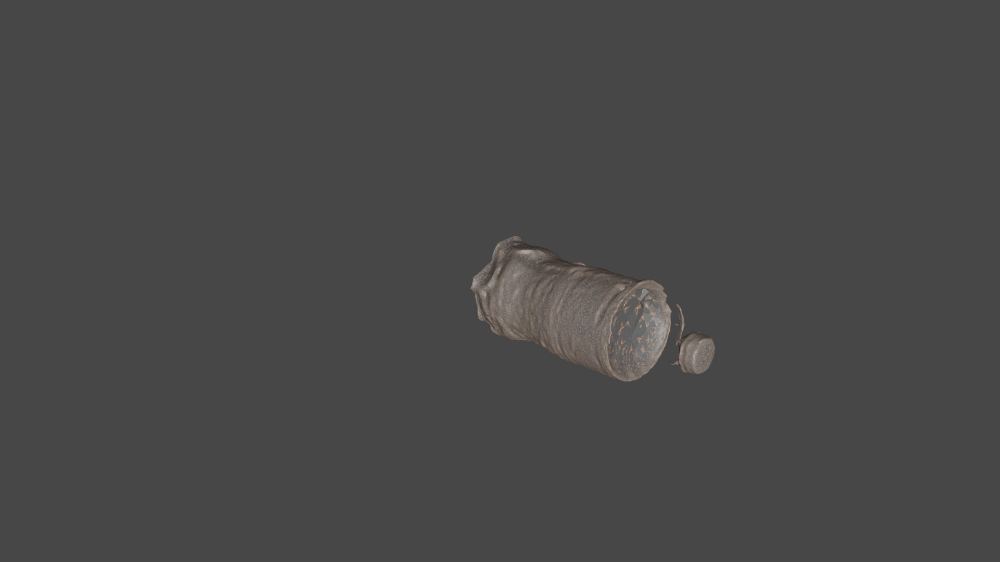
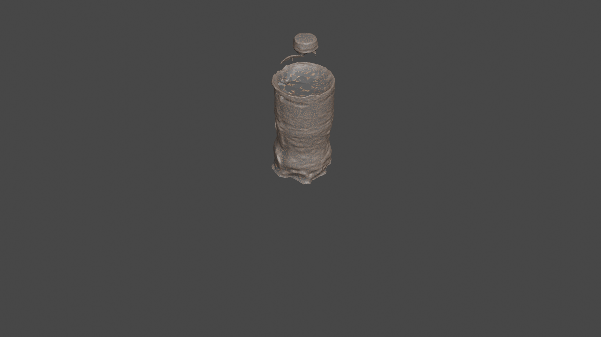
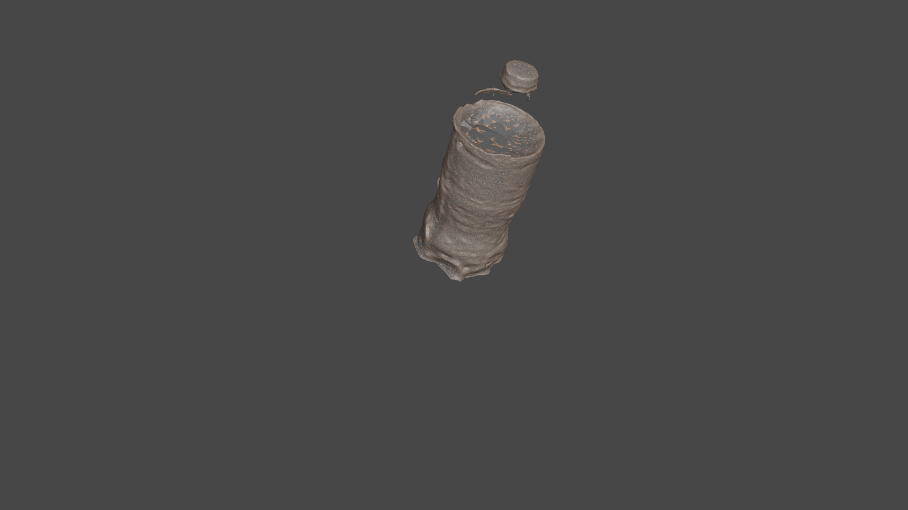

# Blender

## Useful links

1. [bpycv](https://github.com/DIYer22/bpycv)

2. [PVnet-rendering](https://github.com/zju3dv/pvnet-rendering)

3. [Blender-CLI-rendering](https://github.com/yuki-koyama/blender-cli-rendering)

4. [BlenderProc](https://github.com/DLR-RM/BlenderProc)

## 1. Create a 3D model of Coca-Cola exported from the .stl file

## 2. How to run this project?

- Open Blender file named Create_model.blend
- Click in the workspace tab _Scripting_ , then Run Script.

Example 1             |  Example 2 
:-------------------------:|:-------------------------:
  |  

 

Example 3              |  Example 4 
:-------------------------:|:-------------------------:
  |  

 

TODO:
- [ ] Fix issue with the wrong mesh textures. 

# Blender Script Unit Tests

This document outlines the unit tests for the Blender script. The tests cover various aspects of the script's functionality, ensuring that it behaves as expected under different scenarios.

## Test Cases

### File Paths and Image Loading

- Test STL and image file paths exist
- Test image loading and existence

### Scene Setup

- Test camera and light creation

### Mesh Import and Material

- Test mesh import and material assignment

### Texture Mapping and Variation

- Test texture coordinate generation and mapping
- Test random mesh transformations

### Rendering and Image Generation

- Test rendering settings configuration
- Test image generation for scenes and angles
- Test image resolution and format

### Cleanup and Error Handling

- Test camera removal after rendering
- Test handling of no valid mesh object
- Test error handling for file paths and image loading

### Limit Tests

- Test image generation limit per scene
- Test scene generation limit

### Overall Script Integration

- Test entire script execution end-to-end with different scenarios

## Usage

To run the unit tests, follow these steps:

1. Set up the necessary paths and variables in the `TestBlenderScript` class.
2. Open the Blender Text Editor.
3. Copy and paste the test code into a new script.
4. Run the script to execute the unit tests.

# Blender Script

This Blender script generates random scenes and renders images of a 3D model. It applies texture color from an image file to the model and creates variations in scene composition.

## Features

- Generates random scenes with texture-applied models
- Applies texture color from an image to the model
- Creates variations in mesh transformations and camera angles

## Usage

1. Open the Blender Text Editor.
2. Copy and paste the script code into a new script.
3. Customize the file paths and parameters as needed.
4. Run the script to generate and render random scenes.

## Unit Tests

For ensuring the functionality and correctness of the script, there are unit tests available. Refer to the [Unit Tests](unit-tests.md) document for detailed test cases and instructions on running the tests.

## Dependencies

- Blender 3.0 or later

## License

This project is licensed under the [MIT License](LICENSE).
